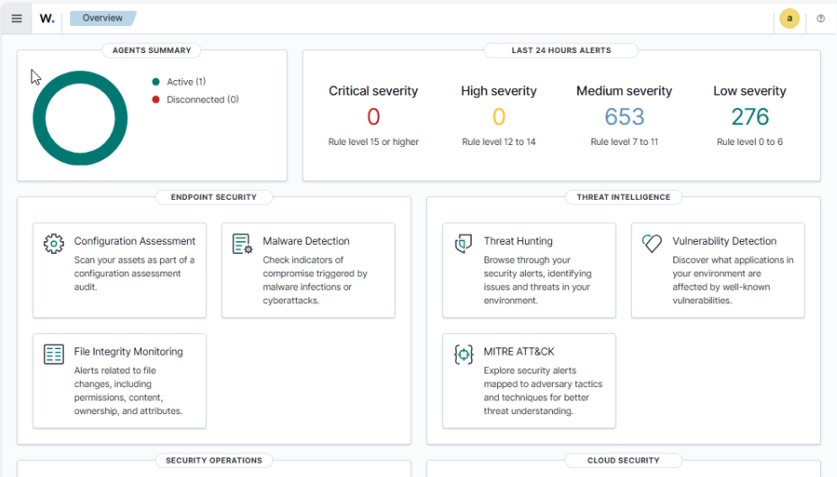
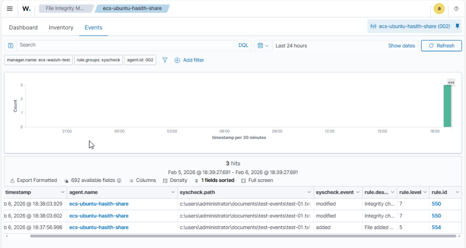

# Building a Threat Detection SOC with Wazuh

## 1. Project Overview
**Objective:** Deployed a SIEM solution to detect security threats and monitor file integrity in real-time.
**Tools Used:** Wazuh Manager (Ubuntu), Wazuh Agent (Windows 10), Orel Cloud.

## 2. Infrastructure Setup
* **Wazuh Manager:** Hosted on Ubuntu 20.04 VM (IP: 172.30.10.196).
* **Wazuh Agent:** Installed on Windows Host (IP: 172.30.10.27).
* **Network:** Bridged connection allowing direct communication on the 172.30.x.x subnet.
* (images/1-wazuh-architecture.png)
* 

## 3. Installation & Configuration
### Manager Installation
Used the automated installation script to deploy the Manager, Indexer, and Dashboard.
Verified package integrity using GPG keys to ensure security.
(images/image 8.png)
(images/image 9.png)
(images/image 1.png)
(images/image 2.png)
(images/image 3.png)

### Agent Deployment
I chose the **manual key extraction method** (`manage_agents`) to understand the underlying authentication process.
1.  Generated agent credentials on the Ubuntu server.
(images/image 10.png)
(images/image 11.png)
1.  Extracted the secret key.
2.  Imported the key to the Windows Agent.
(images/image 12.png)

### Option 2 Agent Deployment 

1. We can Get the Code from the WAZUH Dashboard and Run that code in Windows Host and Run the Agent Service.
(images/image 4.png)

2. Copy code Manger generates and past in powershell in windows pc and restart the agent service then you can see agen in Dashboard as well
   (images/image 5.png)
   (images/image 6.png)
   (images/image 7.png)

## 4. Threat Simulation: File Integrity Monitoring (FIM)
Configured `ossec.conf` to monitor the `C:\Users\abc\Test` directory for changes.

**Test Case:**
1.  Created a file named `secret.txt` in the monitored folder.
(images/image 13.png)
(images/image 14.png)
(images/image 16.png)

1.  Wazuh immediately triggered an alert: "File added to the system."

## 5. Conclusion
This lab demonstrated the effectiveness of Wazuh for real-time threat detection. I gained hands-on experience in:
* SIEM Architecture
* Linux/Windows Interoperability
* Log Analysis & Syscheck Configuration"# Wazuh-SOC-Lab" 
